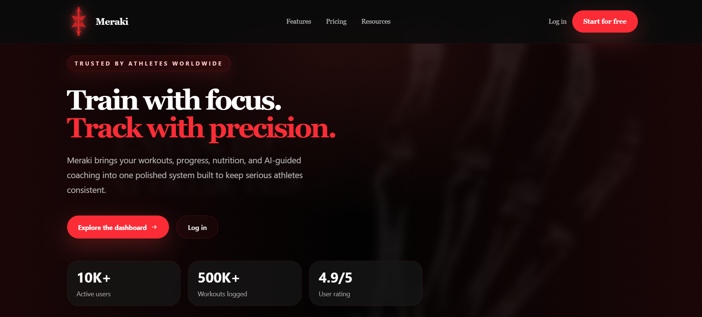
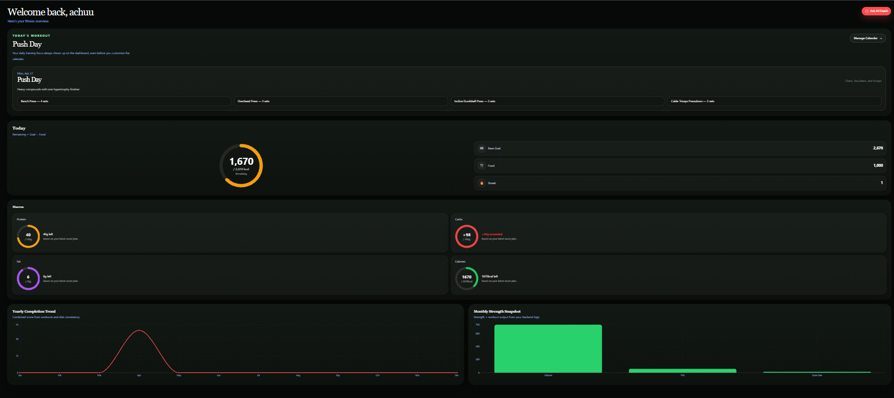
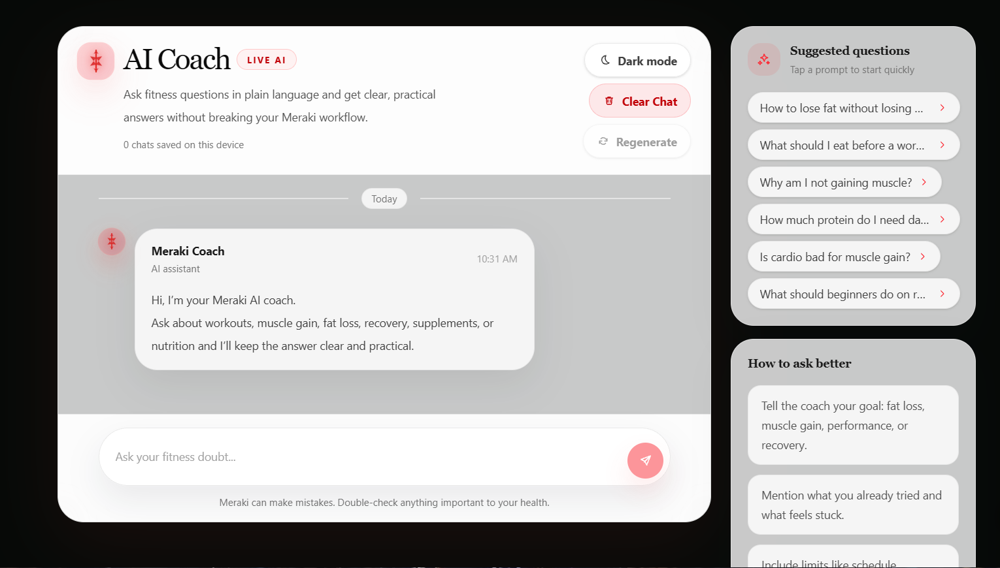
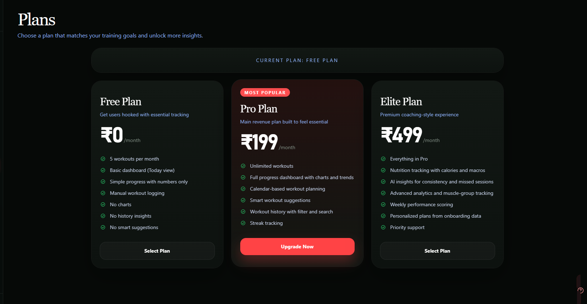

<a id="readme-top"></a>

<div align="center">


# Meraki

A structured system for tracking workouts, analyzing progress, and enforcing consistency.

<a href="https://meraki-jet.vercel.app/">
  
</a>
<a href="https://github.com/ankushx01-dev/meraki">
  
</a>
<a href="https://github.com/ankushx01-dev/meraki/issues">
  
</a>

</div>

---

## Overview

Meraki is designed to remove ambiguity from training.

It answers three questions:

* What did you do?
* Are you improving?
* Are you consistent?

Everything else is intentionally ignored.

---

## System Design

Client (Next.js UI)
→ API Layer (Next.js Route Handlers)
→ Business Logic (Streak, Workout, Progress Modules)
→ Database (MongoDB)

External integrations:

* AI → OpenAI API
* Payments → Razorpay

---

## Core Features

### Workout Engine

* Structured logging (sets, reps, weight)
* Session-based tracking
* Persistent storage with validation

### Progress Analytics

* Weekly aggregation
* Strength trend tracking
* Derived metrics (volume, frequency)

### Streak System

* Consecutive day calculation
* Weekly completion metrics
* Real-time sync across dashboard and calendar

### AI Coach

* Context-aware prompts
* Fitness and nutrition assistance
* Built using OpenAI API

### Calendar Integration

* Week-based visualization
* Real-time sync with workouts and streaks

---

## Tech Stack

<p align="center">


</p>

---

## Architecture

Client (Next.js)
↓
API Routes
↓
Business Logic Layer
↓
MongoDB

AI → OpenAI
Payments → Razorpay

---

## API Overview

### Workout APIs

* POST /api/workout-session
* GET /api/workout-calendar

### Streak APIs

* POST /api/streak
* GET /api/streak

### AI API

* POST /api/ai-doubt

All endpoints follow structured validation and response handling.

---

## Key Implementation Details

* Type-safe API routes using Next.js App Router
* Custom providers for shared state (streak system)
* Utility-driven architecture (streak-utils, validation)
* Strict TypeScript checks for production builds
* Clean separation of UI, logic, and persistence

---

## Preview

### Homepage

<p align="center">
  
</p>

### Dashboard

<p align="center">
  
</p>

### AI Coach

<p align="center">
  
</p>

### Plans

<p align="center">
  
</p>

---

## Getting Started

```bash
git clone https://github.com/ankushx01-dev/meraki.git
cd meraki
npm install
npm run dev
```

---

## Environment Configuration

```env
MONGO_URI=
NEXTAUTH_SECRET=
RAZORPAY_KEY_ID=
RAZORPAY_KEY_SECRET=
OPENAI_API_KEY=
```

Sensitive values must never be committed.

---

## Deployment

* Hosted on Vercel
* Automatic deployment via GitHub
* Requires environment variables

---

## Performance Considerations

* Controlled component re-renders
* Efficient date handling for streak logic
* Minimal client-side state
* Server-side aggregation

---

## Roadmap

* Advanced analytics
* AI personalization
* Mobile optimization
* Subscription system

---

## Contributing

Contributions are welcome.

If you find an issue, have an idea for improvement, or want to extend the system, feel free to open a pull request or start a discussion.

The project is modular and designed for extension.

If you are interested in collaborating, you are free to reach out.

---

## Author

Ankush Rana

Email
rajputx000@gmail.com

LinkedIn
https://www.linkedin.com/in/ankush-rana-x01

---

## Closing

Meraki does not attempt to motivate.

It exposes your consistency with clarity.
